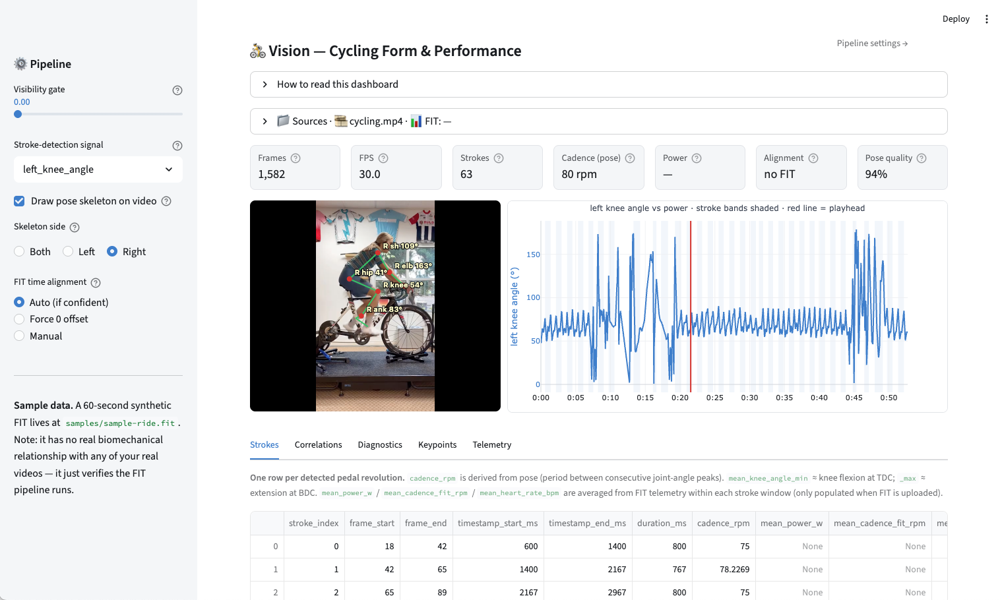

# Vision — Cycling Form & Performance Analyzer

[](https://github.com/caldvs/cycling-form/actions/workflows/ci.yaml)

Given an indoor-trainer cycling video and its FIT file, this project produces explainable per-stroke pose-vs-telemetry correlations — for example, *"knee-over-pedal-spindle drift correlates with power drop after minute 20."* It fuses MediaPipe pose landmarks with Garmin FIT power/cadence/speed and Open-Meteo weather, then surfaces stroke-level metrics in a Streamlit viewer on Cloud Run. It is a portfolio piece engineered to demonstrate four JD areas in one self-contained repo: **computer vision / pose estimation**, **GCP-based ML workloads**, **sport/performance telemetry**, and **CS/Engineering practices**. Built for one user (the project owner); not multi-tenant, not real-time, not a coaching prescription engine.



> Local Streamlit dashboard: MediaPipe pose skeleton + joint-angle labels overlaid on the source video, a synced chart of the chosen joint angle (left, blue) and FIT power (right, orange), per-stroke band shading, and a red playhead that tracks `currentTime`. Tabs underneath surface the per-stroke table, correlations, and pose-quality diagnostics.

## JD-bullet → code mapping

| JD area | Demonstrated by | Code/doc references | Status |
|---|---|---|---|
| CS/Engineering | (filled by Phase 0 + Phase 2 + Phase 6 — toolchain, container hygiene, CI/CD) | `pyproject.toml`, `.github/workflows/ci.yaml`, `pipeline/*/Dockerfile`, `tests/` | placeholder |
| Computer vision / pose estimation | (filled by Phase 1 + Phase 5 — MediaPipe Tasks API, One-Euro filter, visibility gating, per-stroke metrics, annotated frame strip) | `lib/vision/`, `pipeline/pose/`, `pipeline/features/`, `tests/test_pose*.py`, `docs/filming-protocol.md` | placeholder |
| GCP-based ML workloads | (filled by Phase 3 + Phase 4 + Phase 5 — Cloud Run Jobs, GCS, BigQuery, Workflows, Eventarc, Streamlit viewer on Cloud Run Service) | `pipeline/*/`, `infra/workflows/`, `infra/bigquery/`, `scripts/bootstrap-gcp.sh`, `viewer/` | placeholder |
| Sport/performance telemetry | (filled by Phase 1 + Phase 3 — official Garmin FIT SDK, pause-event handling, indoor/outdoor detection, gear inference ±1 cog, Open-Meteo enrichment, BigQuery telemetry_raw + fused_timeline view) | `pipeline/fit/`, `lib/vision/schemas/`, `tests/test_fit*.py` | placeholder |

## What this does NOT do

The project intentionally avoids a set of anti-features so the JD-signal payload stays sharp. Phase 6 (PORT-02) fills the bullet list below from `.planning/REQUIREMENTS.md` § "Out of Scope". For now the section header exists so later phases can append.

<!-- Phase 6 (PORT-02) populates this list. -->

## Architecture

A four-stage batch pipeline — **pose → fit → features → correlate** — runs as Cloud Run Jobs with GCS as the durable artifact bus and BigQuery as the analytical sink. A Streamlit viewer (Cloud Run Service) fronts the warehouse for interactive timeline + correlation inspection. Region is pinned via a single `GCP_REGION` env var (D-07..D-10). Phase 6 (PORT-04) embeds the rendered architecture diagram here; until then, see `.planning/research/ARCHITECTURE.md` for the design contract.

<!-- TODO Phase 6 (PORT-04): embed mermaid/static architecture diagram here -->

## Cost story

GCP spend is capped at **$20/month** by a billing budget with alerts at 50/90/100% of the cap. A Pub/Sub → Cloud Function (Gen 2) kill switch — vendored from `Cyclenerd/poweroff-google-cloud-cap-billing` (Apache-2.0) — disables billing on the project if the cap is breached. All Cloud Run resources are deployed with `--min-instances=0` so the steady-state idle cost is zero. The kill switch is tested end-to-end on a throwaway project before it is trusted on the live project. See `infra/kill-switch/README.md` for the one-way-door warning and recovery procedure.

## Filming protocol

The four hard locks (camera at bottom-bracket height ±2 cm, fiducial visible in frame, ≥60 fps capture, constant frame rate, tripod-only) are documented in `docs/filming-protocol.md`. Pose work downstream assumes the protocol; clips that violate any lock are rejected at ingest.

## Local development

```bash
curl -LsSf https://astral.sh/uv/install.sh | sh
```

```bash
uv sync
```

```bash
uv run ruff check . && uv run mypy lib tests && uv run pytest -q
```

See CONTRIBUTING.md for the full local-development policy and the 'never commit secrets' rules.

### Pose extraction

Install the runtime extras and run the CLI against any indoor-trainer video. The MediaPipe Pose Landmarker model (~9 MB) auto-downloads to `./models/` on first run.

```bash
uv sync --extra pose --extra data --extra cli
uv run vision pose-extract path/to/ride.mp4 --out keypoints.parquet --overlay overlay.mp4 --ride-id myride
```

### Web UI (Streamlit)

A single-page upload-and-process viewer is also available. Same pose pipeline, browser front end.

```bash
uv sync --extra pose --extra data --extra cli --extra viewer
uv run streamlit run viewer/app.py
```

Open the printed `http://localhost:8501` URL, drop in an `.mp4`, click **Process video**. Outputs: a keypoints Parquet (downloadable), a `left_knee` y-coordinate timeline, and optionally a skeleton-overlay MP4.

## GCP setup (Phase 0)

The operator runs the bootstrap once on their workstation — it requires an active GCP billing account.

1. `cp scripts/bootstrap-gcp.env.example scripts/bootstrap-gcp.env`
2. Fill in `GCP_PROJECT_ID`, `ALERT_EMAIL`, and `BILLING_ACCOUNT_ID` in the new env file (the `.env` file is gitignored).
3. `./scripts/bootstrap-gcp.sh` (creates the project, budget, and kill switch).

> Warning: run `./scripts/test-kill-switch.sh` against a throwaway project once before relying on the kill switch on the live project. Disabling billing is a one-way door — see `infra/kill-switch/README.md` for the recovery procedure.

## Layout

```text
.github/workflows/ci.yaml          # Phase 0 — lint + type + test CI
docs/filming-protocol.md           # Phase 0 — the four hard locks for indoor-trainer video
infra/kill-switch/                 # Phase 0 — vendored Cyclenerd billing kill switch
lib/vision/                        # Phase 0 + 1+ — importable Python package (schemas, helpers)
scripts/bootstrap-gcp.sh           # Phase 0 — gcloud setup script (project, budget, kill switch)
scripts/test-kill-switch.sh        # Phase 0 — end-to-end kill-switch verification
tests/                             # Phase 0 + 1+ — pytest suite
pyproject.toml + uv.lock           # Phase 0 — toolchain pins (Python 3.12, ruff, mypy, pytest)
pipeline/pose/                     # Phase 2 — MediaPipe pose extraction Cloud Run Job
pipeline/fit/                      # Phase 2 — Garmin FIT parsing Cloud Run Job
pipeline/features/                 # Phase 2 — per-stroke metric extraction
pipeline/correlate/                # Phase 2 — pose × telemetry correlations into BigQuery
viewer/                            # Phase 5 — Streamlit timeline + correlations viewer
.planning/                         # GSD planning artifacts (phases, requirements, roadmap)
```

## License & credits

- License: MIT (see `pyproject.toml`).
- Vendored components: see `NOTICE`. Currently includes the `Cyclenerd/poweroff-google-cloud-cap-billing` kill switch (Apache-2.0).
