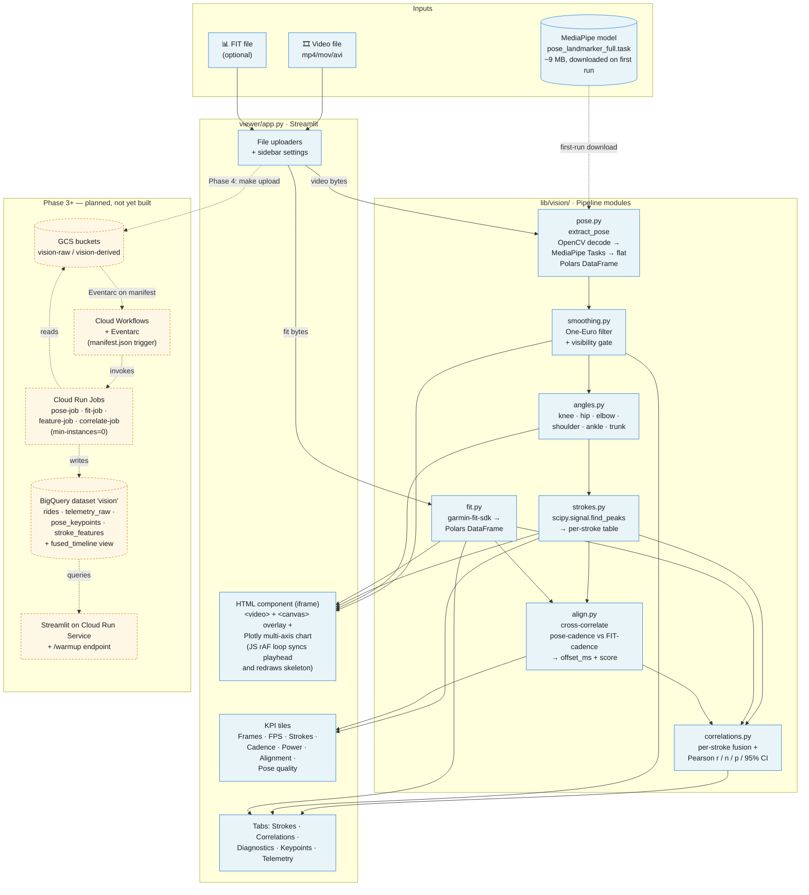

# Vision — System Architecture

This is the architecture **as built today** (Phase 1 MVP — local pipeline + Streamlit viewer). The cloud half (GCS, BigQuery, Cloud Run Jobs, Workflows, Eventarc) is **planned for Phase 3–4** and is drawn dashed.

## Mermaid



## ASCII (terminal-friendly)

```
                    ┌──────────────────────────────────┐
                    │  Browser  ·  http://localhost:8501│
                    │                                   │
   ┌──────────┐     │  ┌─────────────────────────────┐ │
   │ video.mp4│────▶│  │ HTML component (iframe):    │ │
   ├──────────┤     │  │  <video>  +  <canvas>       │ │
   │activity. │────▶│  │  Plotly chart w/ playhead   │ │
   │  fit (?) │     │  │  JS rAF: skeleton + angles  │ │
   └──────────┘     │  └─────────────────────────────┘ │
                    │  KPIs · Tabs (Strokes, Corr, …)  │
                    └────────────┬─────────────────────┘
                                 │  uploaded bytes
                                 ▼
   ┌────────────────────────────────────────────────────────┐
   │  viewer/app.py  (Streamlit)                             │
   │  _run_pipeline(video_bytes, fit_bytes, ride_id, …)      │
   └──────────────────────┬─────────────────────────────────┘
                          │
                          ▼
   ┌────────────────────────────────────────────────────────┐
   │  lib/vision/  (pure Python pipeline)                    │
   │                                                          │
   │    pose.py          ──┐                                  │
   │    (MediaPipe +       │                                  │
   │     OpenCV)           ▼                                  │
   │                   smoothing.py     fit.py                │
   │                   (One-Euro +      (garmin-fit-          │
   │                   visibility)       sdk)                 │
   │                       │              │                   │
   │                       ▼              │                   │
   │                   angles.py          │                   │
   │                       │              │                   │
   │                       ▼              │                   │
   │                   strokes.py         │                   │
   │                   (scipy.signal      │                   │
   │                    find_peaks)       │                   │
   │                       │              │                   │
   │                       └──────┬───────┘                   │
   │                              ▼                            │
   │                          align.py                         │
   │                          (cross-correlate                 │
   │                           pose × FIT cadence)             │
   │                              │                            │
   │                              ▼                            │
   │                       correlations.py                     │
   │                       (per-stroke fuse +                  │
   │                        Pearson r/n/p/CI)                  │
   │                              │                            │
   │                              ▼                            │
   │                       AnalysisBundle                      │
   └─────────────────────────────────────────────────────────┘

   ─ ─ ─ ─ ─ ─ ─ ─ ─ ─ ─ ─ ─ ─ ─ ─ ─ ─ ─ ─ ─ ─ ─ ─ ─ ─ ─ ─ ─ ─
   PLANNED, NOT YET BUILT  (Phases 3–6)
   ─ ─ ─ ─ ─ ─ ─ ─ ─ ─ ─ ─ ─ ─ ─ ─ ─ ─ ─ ─ ─ ─ ─ ─ ─ ─ ─ ─ ─ ─

   make upload ──▶ GCS  ──▶ Eventarc ──▶ Cloud Workflows
                                              │
                                              ▼
                              ┌────────────────┴────────────────┐
                              │   four Cloud Run Jobs:          │
                              │   pose-job · fit-job ·          │
                              │   feature-job · correlate-job   │
                              └────────────────┬────────────────┘
                                               ▼
                                         BigQuery (vision)
                                               │
                                               ▼
                                  Streamlit on Cloud Run Service
                                  (read-only, --min-instances=0)
```

## Notes

- **Blue boxes / solid arrows** are built and exercised by the test suite (`uv run pytest -q`).
- **Orange dashed boxes** are the Phase 3-5 cloud target. Nothing in the orange section runs today.
- **The two halves of the pipeline are deliberately decoupled** (`pose.py` knows nothing about FIT, and vice versa). This is the same shape Phase 4's Cloud Workflows will preserve — `pose-job` and `fit-job` run in parallel branches, joined by `feature-job` → `correlate-job`.
- **One-Euro smoothing happens after pose extraction, not inside MediaPipe** — keeps the smoothing tunable without retraining anything.
- **Time alignment is a pure SQL transform in Phase 3** (per-ride offset stored on the `rides` row, applied by the `fused_timeline` BigQuery view). The Phase 1 `align.py` is what computes that offset; in cloud, it would write it to the `rides` table and the view would do the join.
- **The HTML component is a single iframe** containing both the `<video>` and the Plotly chart so the JS `requestAnimationFrame` loop can read `vid.currentTime` and update both the chart playhead and the skeleton canvas in lockstep. Streamlit's stock widgets don't expose video time, so this is the only way to get the sync.
