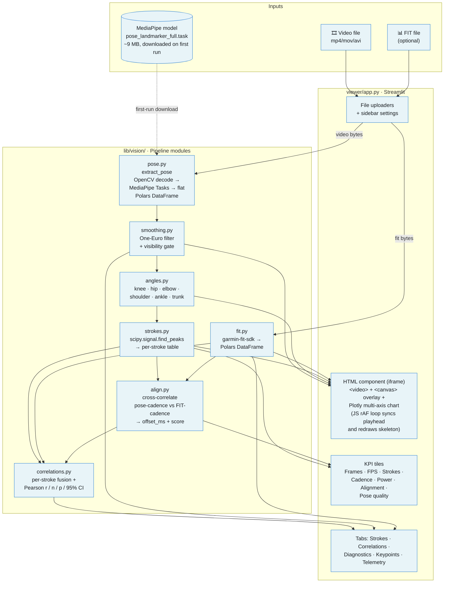

# Architecture

A local Python pipeline + a Streamlit dashboard. One MediaPipe pose model under the hood; everything else is classical signal processing and statistics.

## Mermaid



## ASCII

```
                    ┌──────────────────────────────────┐
                    │  Browser  ·  http://localhost:8501│
                    │                                   │
   ┌──────────┐     │  ┌─────────────────────────────┐ │
   │ video.mp4│────▶│  │ HTML component (iframe):    │ │
   ├──────────┤     │  │  <video>  +  <canvas>       │ │
   │activity. │────▶│  │  Plotly chart w/ playhead   │ │
   │  fit (?) │     │  │  JS rAF: skeleton + angles  │ │
   └──────────┘     │  └─────────────────────────────┘ │
                    │  KPIs · Tabs (Strokes, Corr, …)  │
                    └────────────┬─────────────────────┘
                                 │  uploaded bytes
                                 ▼
   ┌────────────────────────────────────────────────────────┐
   │  viewer/app.py  (Streamlit)                             │
   │  _run_pipeline(video_bytes, fit_bytes, ride_id, …)      │
   └──────────────────────┬─────────────────────────────────┘
                          ▼
   ┌────────────────────────────────────────────────────────┐
   │  lib/vision/  (pure Python pipeline)                    │
   │                                                          │
   │    pose.py          ──┐                                  │
   │    MediaPipe + OpenCV │                                  │
   │                       ▼                                  │
   │                   smoothing.py     fit.py                │
   │                   One-Euro +      garmin-fit-sdk         │
   │                   visibility        │                    │
   │                       │              │                   │
   │                       ▼              │                   │
   │                   angles.py          │                   │
   │                   knee/hip/elbow/    │                   │
   │                   shoulder/ankle     │                   │
   │                       │              │                   │
   │                       ▼              │                   │
   │                   strokes.py         │                   │
   │                   scipy.signal       │                   │
   │                   find_peaks         │                   │
   │                       │              │                   │
   │                       └──────┬───────┘                   │
   │                              ▼                            │
   │                          align.py                         │
   │                          cross-correlate                  │
   │                          pose × FIT cadence               │
   │                              │                            │
   │                              ▼                            │
   │                       correlations.py                     │
   │                       per-stroke fuse +                   │
   │                       Pearson r/n/p/CI                    │
   │                              │                            │
   │                              ▼                            │
   │                       AnalysisBundle                      │
   └──────────────────────────────────────────────────────────┘
```

## Notes

- **The two halves of the pipeline are decoupled.** `pose.py` doesn't know FIT exists; `fit.py` doesn't know about pose. They meet at `align.py` and `correlations.py`.
- **One-Euro smoothing runs after pose extraction**, not inside MediaPipe, so the smoothing parameters stay tunable without retraining anything.
- **The HTML component is a single iframe** containing both the `<video>` element and the Plotly chart, so a single JS `requestAnimationFrame` loop can read `vid.currentTime` and update the chart playhead + the skeleton canvas in lockstep. Streamlit's stock widgets don't expose video time, which is why we build a custom component.
- **Only one ML model in the system**: MediaPipe Pose Landmarker (`pose_landmarker_full.task`, BlazePose architecture). Everything downstream — smoothing, angles, strokes, alignment, correlations — is classical signal processing and statistics.
